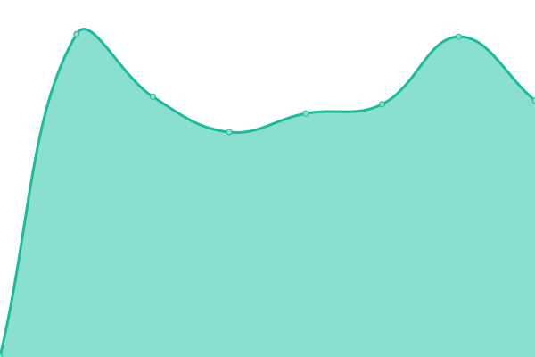
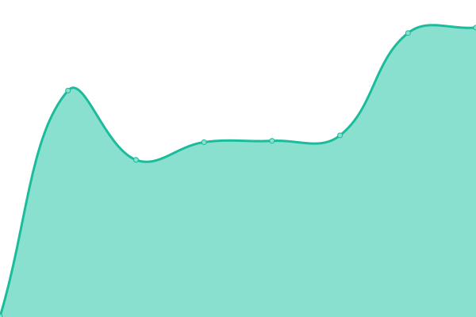

# [📈 Live Status](https://aurashadowsong.github.io/upptime): <!--live status--> **🟥 Complete outage**

This repository contains the open-source uptime monitor and status page for [aurashadowsong](https://aurashadowsong.github.io/upptime), powered by [Upptime](https://github.com/upptime/upptime).

With [Upptime](https://upptime.js.org), you can get your own unlimited and free uptime monitor and status page, powered entirely by a GitHub repository. We use [Issues](https://github.com/aurashadowsong/upptime/issues) as incident reports, [Actions](https://github.com/aurashadowsong/upptime/actions) as uptime monitors, and [Pages](https://aurashadowsong.github.io/upptime) for the status page.

<!--start: status pages-->
<!-- This summary is generated by Upptime (https://github.com/upptime/upptime) -->
<!-- Do not edit this manually, your changes will be overwritten -->
<!-- prettier-ignore -->
| URL | Status | History | Response Time | Uptime |
| --- | ------ | ------- | ------------- | ------ |
|  [nightstar](https://night.star.ddns-ip.net) | 🟥 Down | [nightstar.yml](https://github.com/aurashadowsong/upptime/commits/HEAD/history/nightstar.yml) | 

 468ms
     
 | 

<a href="https://aurashadowsong.github.io/upptime/history/nightstar">0.00%</a>
    

|  [shadowsong](https://shadowsong.serv00.net) | 🟥 Down | [shadowsong.yml](https://github.com/aurashadowsong/upptime/commits/HEAD/history/shadowsong.yml) | 

 786ms
     
 | 

<a href="https://aurashadowsong.github.io/upptime/history/shadowsong">0.00%</a>
    

|  [lewisc93](https://lewisc93.serv00.net) | 🟥 Down | [lewisc93.yml](https://github.com/aurashadowsong/upptime/commits/HEAD/history/lewisc93.yml) | 

 654ms
     
 | 

<a href="https://aurashadowsong.github.io/upptime/history/lewisc93">0.00%</a>
    

|  [socrella](https://socrella.serv00.net) | 🟥 Down | [socrella.yml](https://github.com/aurashadowsong/upptime/commits/HEAD/history/socrella.yml) | 

 739ms
     
 | 

<a href="https://aurashadowsong.github.io/upptime/history/socrella">0.00%</a>
    

|  [windserve](https://windserve.serv00.net) | 🟥 Down | [windserve.yml](https://github.com/aurashadowsong/upptime/commits/HEAD/history/windserve.yml) | 

 693ms
     
 | 

<a href="https://aurashadowsong.github.io/upptime/history/windserve">0.00%</a>
    

|  [grafana](https://alien.birdriver.org) | 🟥 Down | [grafana.yml](https://github.com/aurashadowsong/upptime/commits/HEAD/history/grafana.yml) | 

 0ms
     
 | 

<a href="https://aurashadowsong.github.io/upptime/history/grafana">0.00%</a>
    

<!--end: status pages-->

[**Visit our status website →**](https://aurashadowsong.github.io/upptime)

## 📄 License

- Powered by: [Upptime](https://github.com/upptime/upptime)
- Code: [MIT](./LICENSE) © [Anand Chowdhary](https://anandchowdhary.com), supported by [Pabio](https://pabio.com)
- Data in the `./history` directory: [Open Database License](https://opendatacommons.org/licenses/odbl/1-0/)
